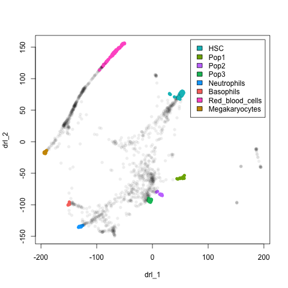

Reconstructing Ordered Ontogenic Trajectories
================
Wajid Jawaid
2017-09-11

<!-- README.md is generated from README.Rmd. Please edit that file -->


[](https://cran.r-project.org/package=roots) [](http://www.repostatus.org/#active) [](https://cran.r-project.org/package=roots/)

Reconstructing ordered ontogenic trajectories provides methods for:

1.  Identifying informative genes (crude),
2.  Finding a sparse graph structure between closely related cells by removing spurious edges and
3.  Traversing the graph in a biologiclal informed way using a Directed Non-markovian Monte-Carlo method.

The main goal of *roots* is to infer plausible developmental journeys guided by the user.

Installation
------------

Can be installed through CRAN or GitHub

### CRAN

``` {.r}
install.packages("roots")
```

### Bleeding edge

``` {.r}
library(devtools)
install_github("wjawaid/roots")
```

Example
-------

Here I take the mouse adult haematopoietic data from [Nestorowa et al.](http://www.bloodjournal.org/content/early/2016/06/30/blood-2016-05-716480). Data is downloaded and processed using the **goggles()** function as below.

``` {.r}
library(roots)

## Load data
blood <- read.table("http://blood.stemcells.cam.ac.uk/data/norm_counts_nestorowa_data.txt",
                    sep = " ")
cellNames <- read.table("http://blood.stemcells.cam.ac.uk/data/cell_names_nestorowa_data.txt",
                        sep = " ", stringsAsFactors = FALSE)[,1]
rownames(blood) <- gsub("LT\\.", "LT-", cellNames)
geneNames <- read.table("http://blood.stemcells.cam.ac.uk/data/gene_names_nestorowa_data.txt",
                        sep = " ", stringsAsFactors = FALSE)[,1]
colnames(blood) <- geneNames
blood <- as.matrix(blood)
rm(cellNames, geneNames)

## Load metadata
meta <- read.csv("http://blood.stemcells.cam.ac.uk/data/wj_out_jd.csv")
colnames(meta) <- c("cellType", "index", "name")
rownames(meta) <- meta$name
meta$col <- bglab::ggCol(meta$cellType)
nmeta <- data.frame(col=rep("#00000011", nrow(blood)), stringsAsFactors = FALSE,
                    row.names = rownames(blood))
nmeta[rownames(meta),"col"] <- meta$col
leg <- data.frame(cell=as.character(unique(meta$cellType)),
                  col=as.character(unique(meta$col)), stringsAsFactors = FALSE)
legOrd <- c(5, 8, 6, 7, 1, 4, 2, 3)

## Analyse
xx <- goggles(blood)

## Plot
plot(xx$l, pch=16, col = nmeta[rownames(xx$l), "col"])
legend("topright", legend = leg$cell[legOrd], fill=leg$col[legOrd], inset=0.02)
```


